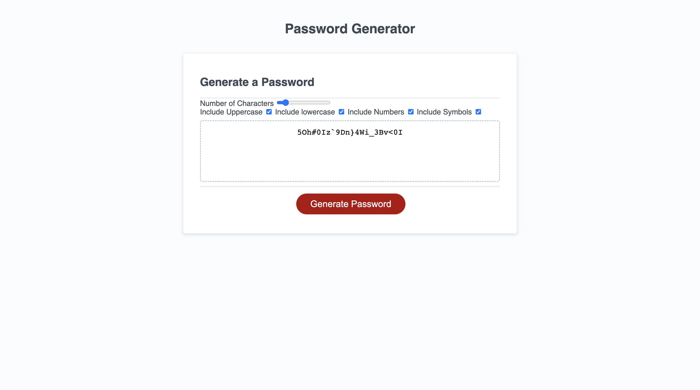

# Password Generator

## Description

For challenge 3, we are supposed to create a page where we could generate random passwords with different criteria, such as numbers, symbols, and uppercase or lowercase letters that the users could choose to have in this password. I wanted the page to have something where the users could put their inputs of what they want for a password, so I added checkboxes and a range button for the value of letters in the HTML. Then we added the strings and arrays in the Javascript.

## Table of Contents

- [Installation](#installation)
- [Usage](#usage)
- [Credits](#credits)
- [License](#license)

## Installation

I used the tools that I had on my computer, like Git, Vscode, Github, and Google. First, I cloned the repo into my local file, made a GitHub repo, and named both the local and global repo the "simplyannz-web-portfolio". I opened the file in my VScode and started coding the project, and used Chrome developer tools to live to check the website for errors and stuff. Then I push it into my GitHub for deployment.

## Usage

## Credits

resources:
https://javascript.plainenglish.io/create-an-array-of-alphabet-characters-in-javascript-with-this-simple-trick-930033079dd3

https://www.youtube.com/watch?v=Xrsb9SiF3a8&t=913s

https://www.digitalocean.com/community/tutorials/understanding-arrays-in-javascript

## License

There is no license on this project!

## contact me

email: anniebui0110@gmail.com
github: https://github.com/simplyannzz
